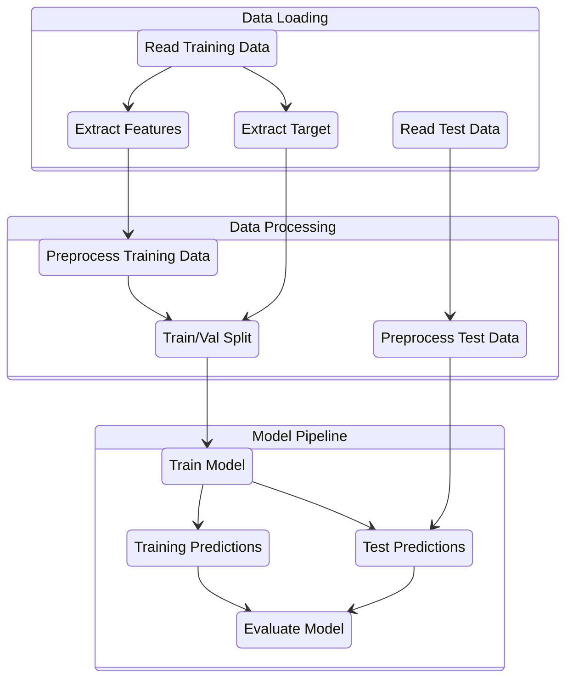

# Binary-Classification-with-a-Bank-Dataset
The goal is to predict whether a client will subscribe to a bank term deposit.



```bibtex
@misc{playground-series-s5e8,
    author = {Walter Reade and Elizabeth Park},
    title = {Binary Classification with a Bank Dataset},
    year = {2025},
    howpublished = {\url{https://kaggle.com/competitions/playground-series-s5e8}},
    note = {Kaggle}
}
```
